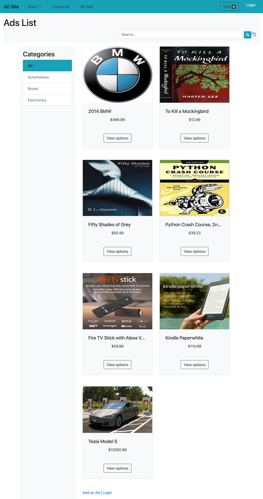
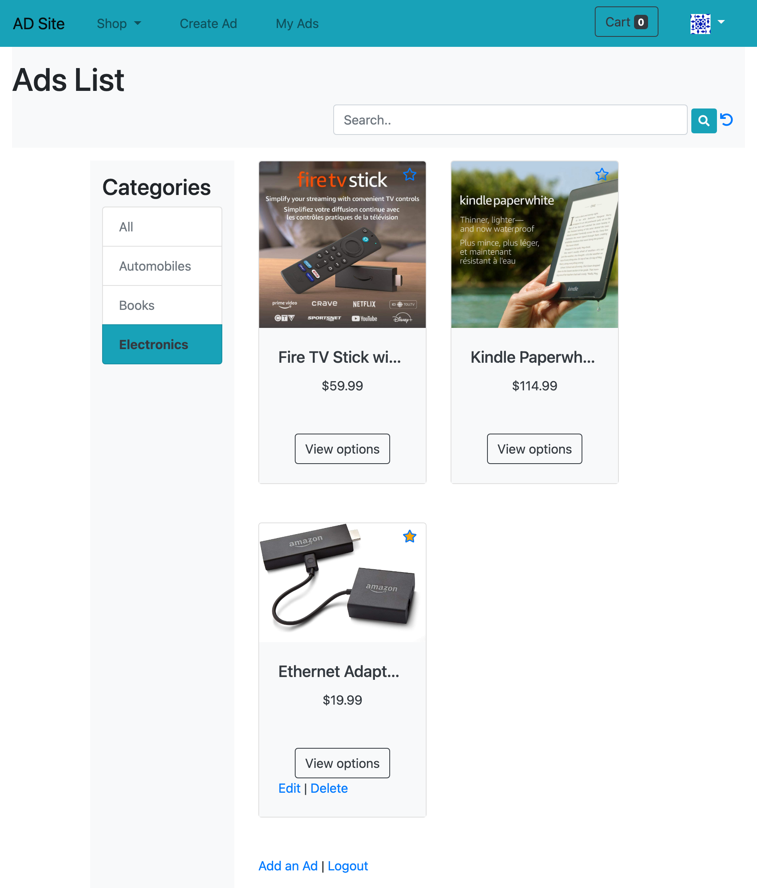
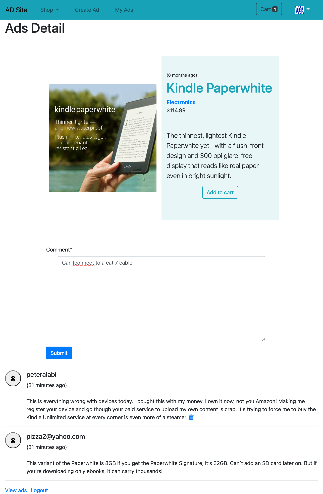
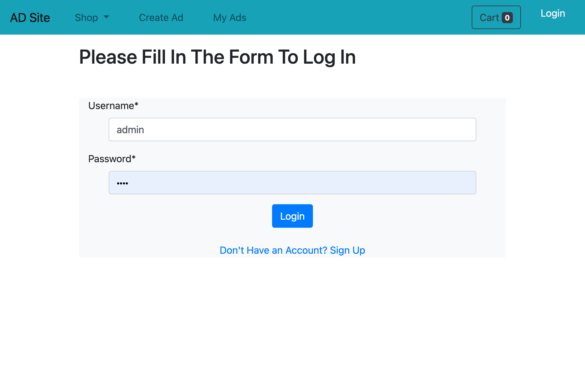
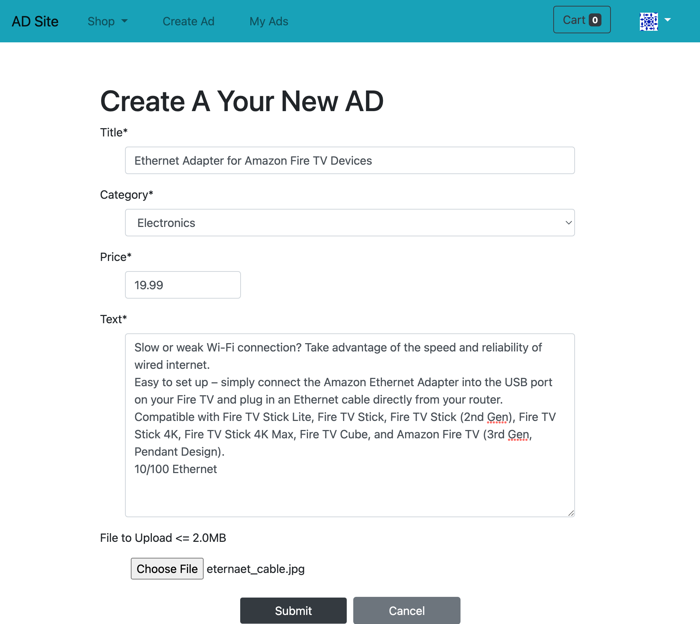
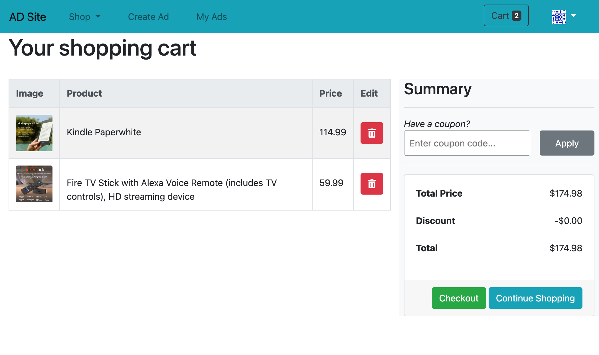

<h1>AD List</h1>
<h2>Description</h2>

A Simple online classified advertising and E-commerce web application. For local intra cities and urban regions, for posting local advertisements.

<h2>Demo</h2>

  

<h2>Developer Team</h2>
<ul>
<li>Fully Developed By Me</li>
</ul>
<h2>Technologies Used</h2>

  <ul>
    <li>
      Bootstrap
    </li>
    <li>
      HTML5
    </li>
    <li >
      CSS
    </li>
    <li >
      Django
    </li>
    <li>
      DRF
    </li>
    <li >
      MySQL
    </li>
    <li>
      Javascript
    </li>
    <li>
      jQuery
    </li>
  </ul>

<h2>App Features</h2>

  <ul>
    <li>
      Login, Register and Authentication Capabilities
    </li>
    <li>
      AD posting and Content Management System (CMS)
    </li>
    <li>
      Clients can browse products
    </li>
    <li>
      Shopping Cart
    </li>
    <li>
      Purchase checkout and Payment gateway with Stripe
    </li>
    <li>
      Admin Management
    </li>
  </ul>

